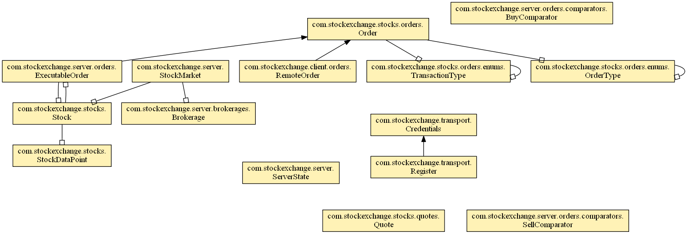

# StockExchange

A basic stock exchange program for Mr. Estep's Analysis of Algorithms class 2016-2017

## Structure

Learn JavaFX
* Stage
* Scene
* Components

Learn Jersey
* Server url @Path
* Client target

Learn Jackson annotations
* @JsonProperty -- allows a private field to be dejsonified
* @JsonCreator -- allows a private constructor to be accessed to dejsonify a json object

## TODO

- [ ] Client
  - [ ] UI
    - [x] Stock Quotes
    - [ ] Stock Details
      - [x] Stock History Graphs
      - [x] Stock Descriptions
      - [x] Stock Table
      - [ ] Stock actions buttons 
    - [ ] Profile
    - [x] Login
    - [x] Registration
    - [ ] Account view
    - [ ] Order view
  - [ ] API
    - [x] Authentication
    - [x] Stock Quotes
    - [ ] Stock Details
    - [ ] Order submit
- [ ] Server
  - [x] Stock History
  - [x] Authentication
  - [x] YahooAPI
  - [ ] Stock Detail serving
  - [x] Stock Quote retrieval
  - [ ] Order processing